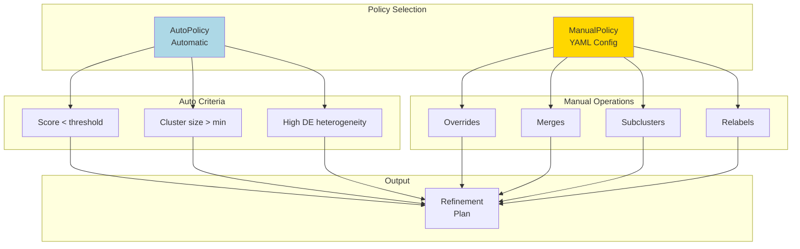

# Refinement Policies

Policies generate refinement plans.

## AutoPolicy

Automatic candidate selection based on:
- Score thresholds
- Cluster size
- DE heterogeneity

## ManualPolicy

Parse YAML configuration files for:
- Overrides
- Merges
- Subclusters
- Relabels
