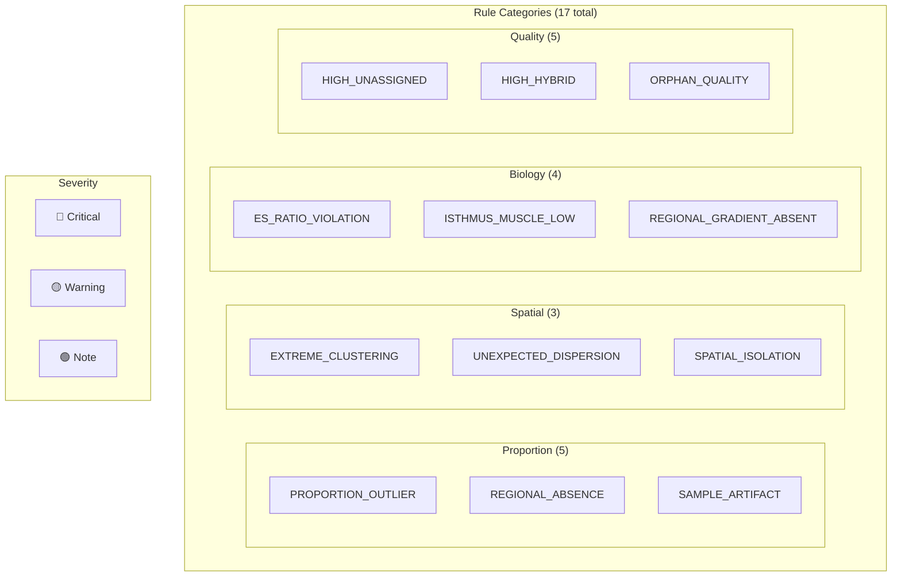

# Flagging Rules

Rules for identifying annotation issues.

```mermaid
flowchart TD
    subgraph Categories["Rule Categories (17 total)"]
        subgraph Proportion["Proportion (5)"]
            P1[PROPORTION_OUTLIER]
            P2[REGIONAL_ABSENCE]
            P3[SAMPLE_ARTIFACT]
        end

        subgraph Spatial["Spatial (3)"]
            S1[EXTREME_CLUSTERING]
            S2[UNEXPECTED_DISPERSION]
            S3[SPATIAL_ISOLATION]
        end

        subgraph Biology["Biology (4)"]
            B1[ES_RATIO_VIOLATION]
            B2[ISTHMUS_MUSCLE_LOW]
            B3[REGIONAL_GRADIENT_ABSENT]
        end

        subgraph Quality["Quality (5)"]
            Q1[HIGH_UNASSIGNED]
            Q2[HIGH_HYBRID]
            Q3[ORPHAN_QUALITY]
        end
    end

    subgraph Severity
        CRIT[🔴 Critical]
        WARN[🟡 Warning]
        NOTE[🟢 Note]
    end
```

## Categories

- Proportion rules
- Spatial rules
- Biology rules
- Quality rules
