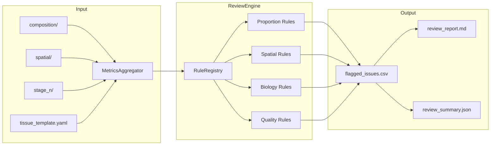
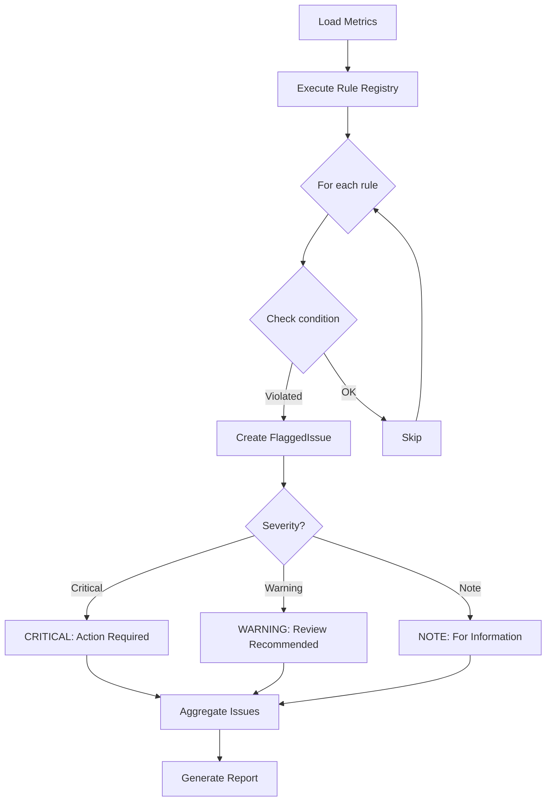

# Review Overview

The review module performs quality control and validation of cell-type annotations using configurable flagging rules.

## Module Architecture

## Flagging Decision Flow

## Features

- **Configurable flagging rules**: 17 rules across proportion, spatial, biology, and quality categories
- **Multi-column comparison**: Compare annotations across `cell_type_phenocycler`, `cell_type_multiomics`, etc.
- **Issue tracking**: Structured output with severity levels (critical, warning, note)
- **Tissue templates**: Expected patterns defined in YAML for tissue-specific validation
