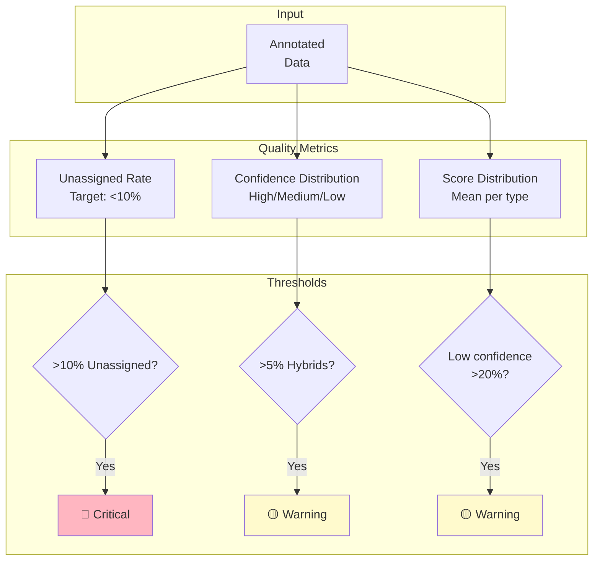

# Quality Metrics

Metrics for assessing annotation quality.

```mermaid
flowchart TD
    subgraph Input
        A[Annotated<br/>Data]
    end

    subgraph Metrics["Quality Metrics"]
        B["Unassigned Rate<br/>Target: <10%"]
        C["Confidence Distribution<br/>High/Medium/Low"]
        D["Score Distribution<br/>Mean per type"]
    end

    subgraph Thresholds
        T1{">10% Unassigned?"} -->|Yes| FAIL1[🔴 Critical]
        T2{">5% Hybrids?"} -->|Yes| FAIL2[🟡 Warning]
        T3{"Low confidence<br/>>20%?"} -->|Yes| FAIL3[🟡 Warning]
    end

    A --> B
    A --> C
    A --> D
    B --> T1
    C --> T2
    D --> T3

    style FAIL1 fill:#FFB6C1
    style FAIL2 fill:#FFFACD
    style FAIL3 fill:#FFFACD
```

## Key Metrics

- Unassigned rate
- Confidence distribution
- Score distribution
