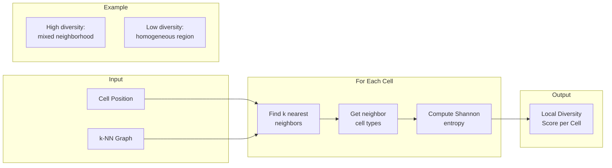

# Local Diversity

Cell-type diversity in each cell's neighborhood.

```mermaid
flowchart LR
    subgraph Input
        A[Cell Position]
        B[k-NN Graph]
    end

    subgraph Compute["For Each Cell"]
        C[Find k nearest<br/>neighbors]
        D[Get neighbor<br/>cell types]
        E[Compute Shannon<br/>entropy]
    end

    subgraph Output
        F[Local Diversity<br/>Score per Cell]
    end

    A --> C
    B --> C
    C --> D
    D --> E
    E --> F

    subgraph Example
        G["High diversity:<br/>mixed neighborhood"]
        H["Low diversity:<br/>homogeneous region"]
    end
```

## Method

Shannon entropy computed on k-nearest neighbors.
