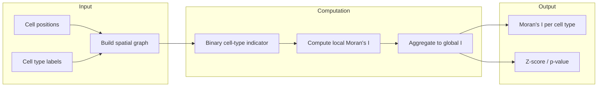
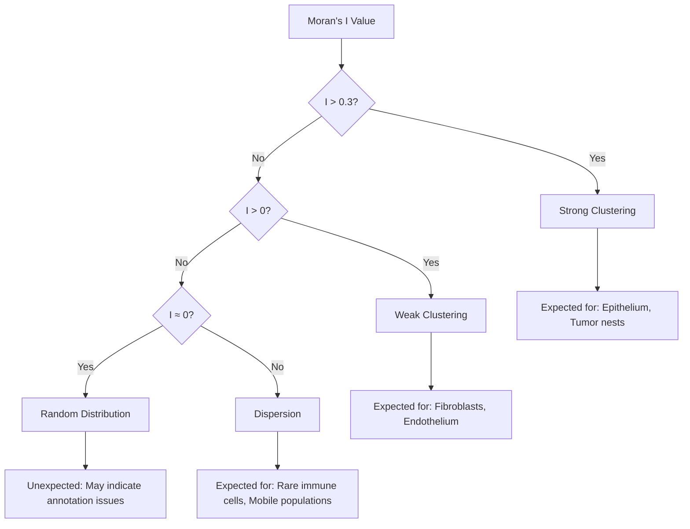

# Moran's I

Moran's I measures spatial autocorrelation—whether cells of the same type cluster together or are dispersed in space.

## Computation Flow

## Interpretation Decision Tree

## Interpretation

| Value | Meaning | Biological Example |
|-------|---------|-------------------|
| \> 0.5 | Strong clustering | Epithelial sheets, tumor nests |
| 0.1–0.5 | Moderate clustering | Fibroblast networks |
| ≈ 0 | Random | Well-mixed immune infiltrate |
| \< 0 | Dispersion | Patrolling immune cells |

## Statistical Significance

The z-score indicates whether the observed Moran's I is significantly different from random:

- **|z| > 2.58**: Significant at p < 0.01
- **|z| > 1.96**: Significant at p < 0.05
- **|z| < 1.96**: Not significant
