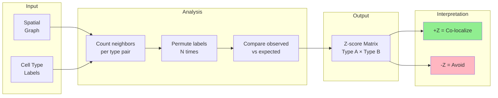

# Neighborhood Enrichment

Which cell types co-locate more than expected?

## Method

Permutation-based Z-score for cell-type pairs.

## Output

Z-score matrix: positive = co-localization, negative = avoidance.
