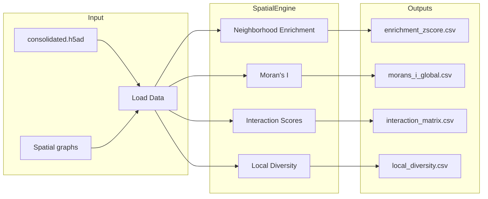

# Spatial Analysis Overview

The spatial module analyzes the spatial organization of cell types, including neighborhood relationships, clustering patterns, and cell-type interactions.

## Module Architecture

## Analysis Types

```mermaid
flowchart TB
    subgraph Neighborhood["Neighborhood Enrichment"]
        N1[Count neighbor pairs] --> N2[Compare to permutation null]
        N2 --> N3[Z-score per cell-type pair]
    end

    subgraph Moran["Moran's I"]
        M1[Binary cell-type indicator] --> M2[Spatial autocorrelation]
        M2 --> M3[Global I per cell type]
    end

    subgraph Interaction["Cell-Type Interactions"]
        I1[Observed contact frequency] --> I2[Normalize by abundance]
        I2 --> I3[Interaction probability matrix]
    end

    subgraph Diversity["Local Diversity"]
        D1[k-nearest neighbors] --> D2[Shannon entropy in neighborhood]
        D2 --> D3[Diversity index per cell]
    end
```

## Features

- **Neighborhood enrichment**: Which cell types co-locate more/less than expected by chance
- **Moran's I**: Spatial autocorrelation (clustering vs. dispersion) per cell type
- **Cell-type interactions**: Normalized contact probabilities between all cell-type pairs
- **Local diversity**: Cell-type diversity in each cell's local neighborhood
